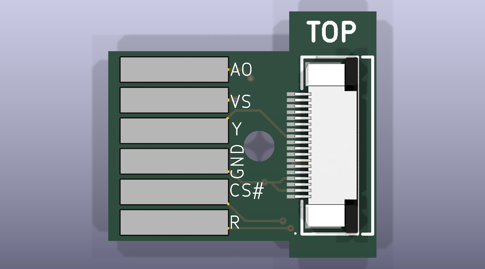
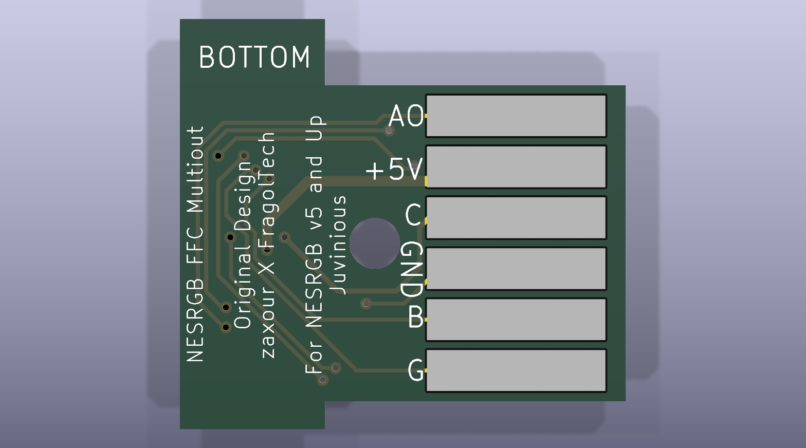

# NESRGB_Multiout

NES Multiout for use with Tim Worthington's NES RGB mod v5.

Same FCC connector that NES RGB uses to match up to the main board. The FCC Connector is 18 positions, [LCSC Part #: C262640](https://www.lcsc.com/product-detail/C262640.html?s_z=n_q_AFC07-S18ECA-00&spm=wm.fly.bg.0.xh&lcsc_vid=RlQIVgJfQwVcBlxQQVAKAl0DQ1BdA1ZSFQAIAlwFRlIxVlNeRlNeUFFWRVhcXjsOAxUeFF5JWBYZEEoKFBINSQcJGk4%3D).

**Top**

**Bottom**

## Origin and attribution

This project began as a fork of [zaxour's NESRGB_Multiout](https://github.com/zaxour/NESRGB_Multiout),
which was published without a license. This repository is an independent
re-implementation in KiCad: the design was converted from the original Eagle
files, the layout reworked, and an FFC connector added. The original Eagle
files and the 2021 gerbers are available from zaxour's repository.

## License

Copyright the NESRGB_Multiout contributors.

This source describes Open Hardware and is licensed under the CERN-OHL-S v2
(`CERN-OHL-S-2.0`). See [LICENSE](LICENSE) for the full text.

You may redistribute and modify this source and make products using it under
the terms of the [CERN-OHL-S v2](https://ohwr.org/cern_ohl_s_v2.txt). This
source is distributed WITHOUT ANY EXPRESS OR IMPLIED WARRANTY, INCLUDING OF
MERCHANTABILITY, SATISFACTORY QUALITY AND FITNESS FOR A PARTICULAR PURPOSE.
Please see the CERN-OHL-S v2 for applicable conditions.

Source location: https://github.com/juvinious/NESRGB_Multiout
