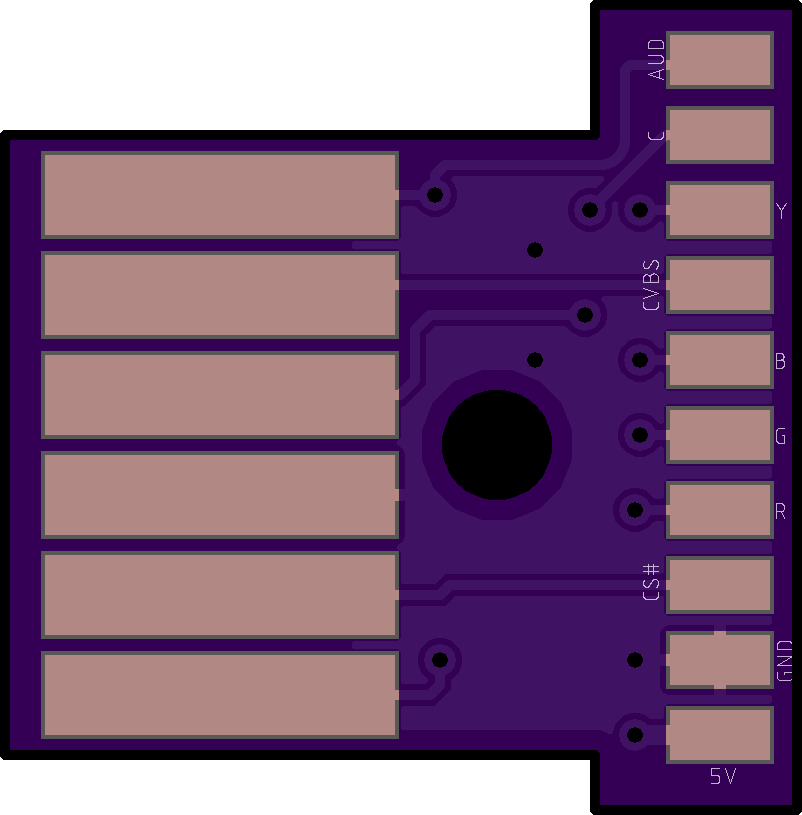
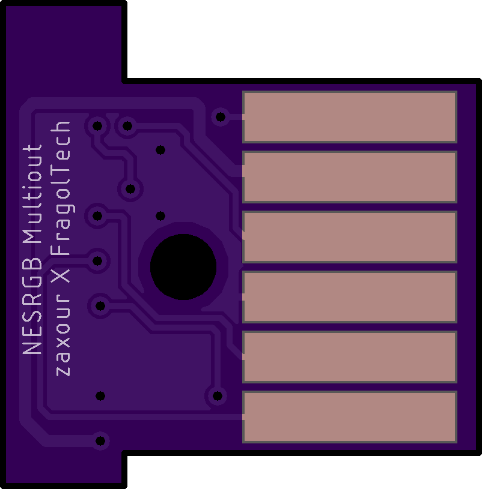

# NESRGB_Multiout
NES Multiout for use with Tim Worthington's NES RGB mod

Pads were laid out to match the NES RGB layout, removing the need to look at a wiring diagram and contort multiple wires to reach the correct pin.

**Top**

**Bottom**

## License

Copyright the NESRGB_Multiout contributors.

This source describes Open Hardware and is licensed under the CERN-OHL-S v2
(`CERN-OHL-S-2.0`). See [LICENSE](LICENSE) for the full text.

You may redistribute and modify this source and make products using it under
the terms of the [CERN-OHL-S v2](https://ohwr.org/cern_ohl_s_v2.txt). This
source is distributed WITHOUT ANY EXPRESS OR IMPLIED WARRANTY, INCLUDING OF
MERCHANTABILITY, SATISFACTORY QUALITY AND FITNESS FOR A PARTICULAR PURPOSE.
Please see the CERN-OHL-S v2 for applicable conditions.

Source location: https://github.com/juvinious/NESRGB_Multiout
